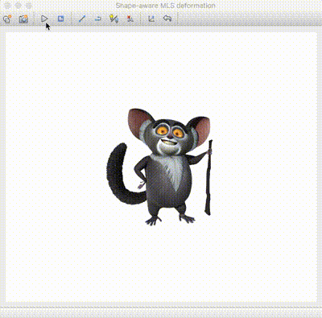

# Maurice
2D deformable animation

*Dependencies: Qt5*

### Compiling:
1. run `qmake`
2. run `make`

### Running:
1. Run the application Maurice in terminal
2. Open an image for deformation. Note that the image needs to have an alpha channel that indicates object region. Sample images can be found in the images folder.
3. Create a **Line Handle** or a **Polyline Handle** from the toolbar over an image part to control deformation.
   - A line handle needs two points using left mouse click.
   - A polyline needs a series of points using left mouse clicks, and the last point specified with the right mouse click.

   Polyline handles are good for curves parts (e.g. a tail). Keep adding as many handles as you wish. Handles should also be added to parts of the image that you do not want to keep static (see demo image below). The two handle buttons stay in the checked state, so you need to click over these again to axit adding handles.
4. Uncheck any button for adding more handles. You can deform the shape by grabbing end points of the handles and dragging these.

The code corrsponds to the following SIGGRAPH Asia publication and is allowed to be used for academic and research purpose (non-commercial):  
*Sharma, Ojaswa, and Ranjith Tharayil. "Shape-aware MLS deformation for line handles." In SIGGRAPH Asia 2015 Technical Briefs, p. 20. ACM, 2015.*  
Please cite the paper in case you choose to use this code.
